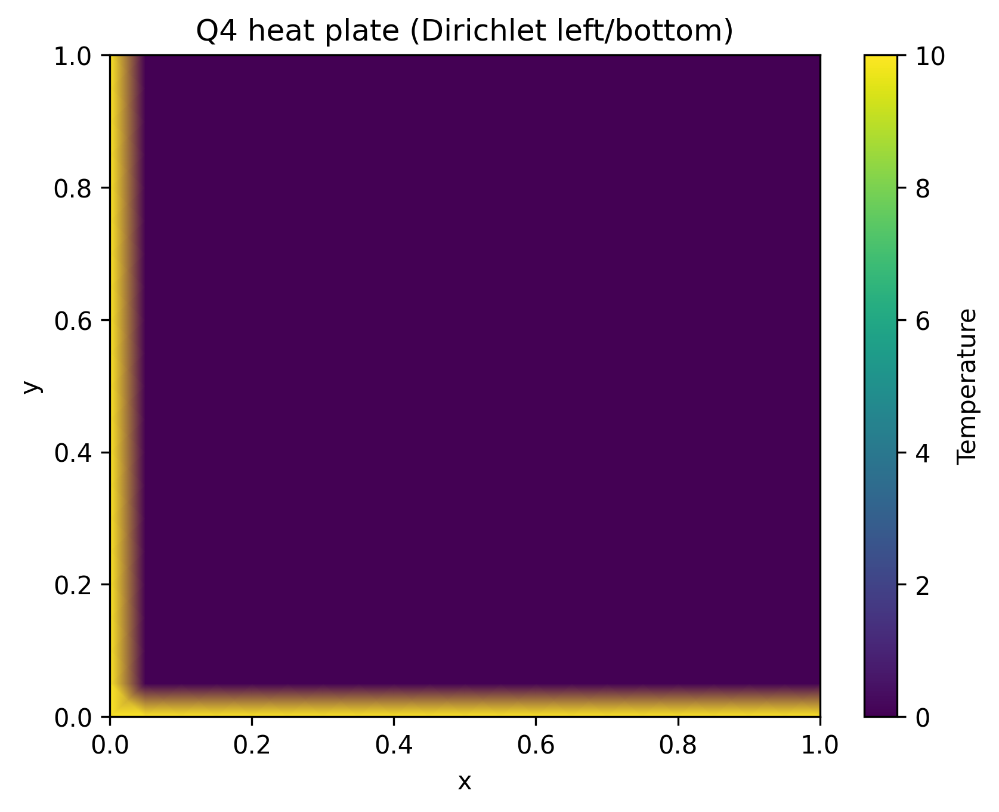
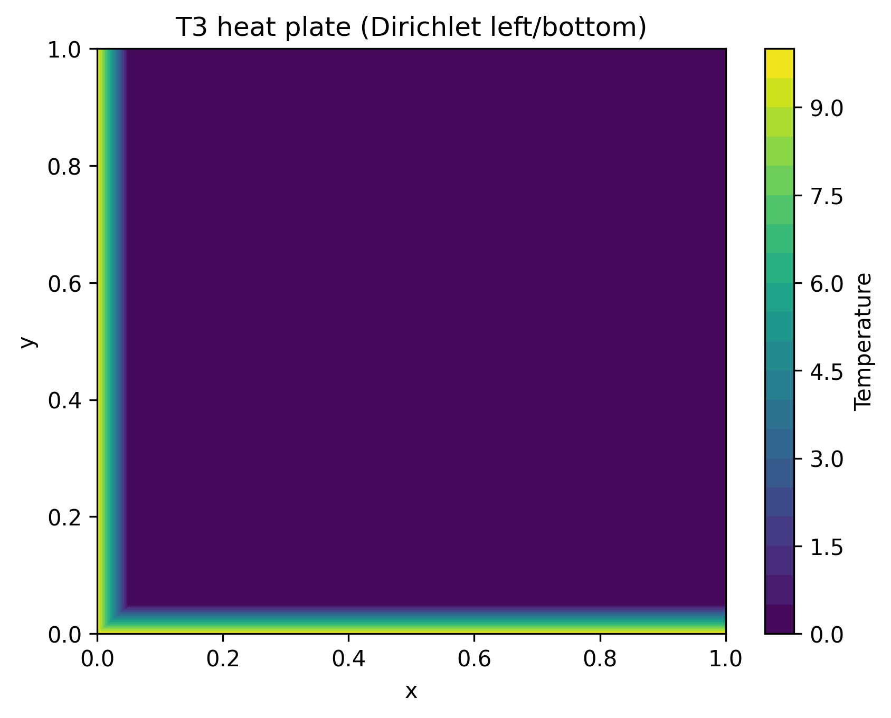
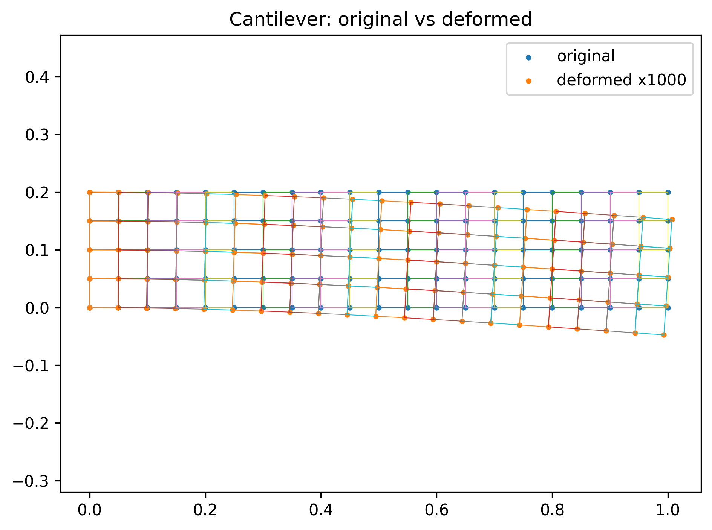
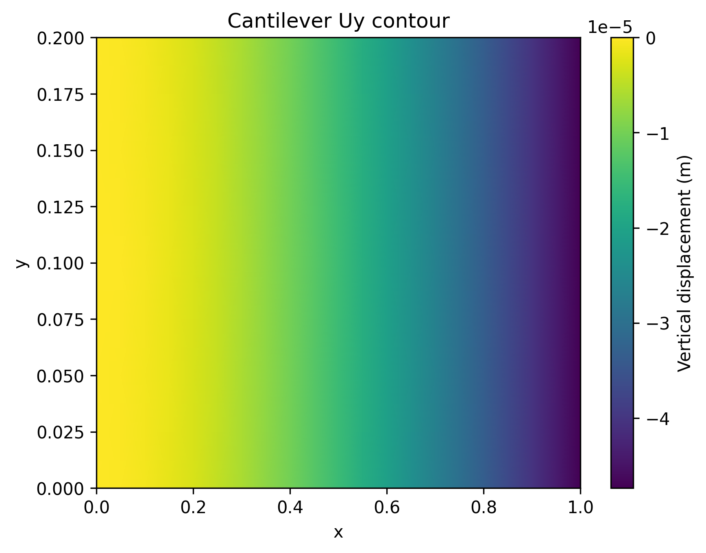
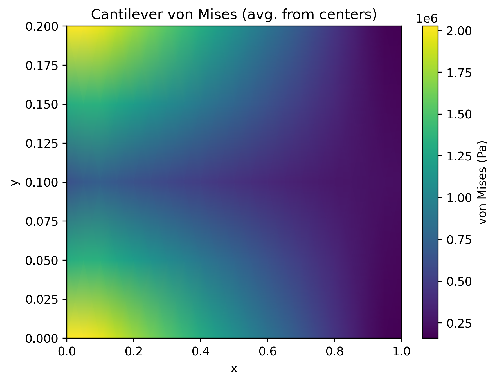
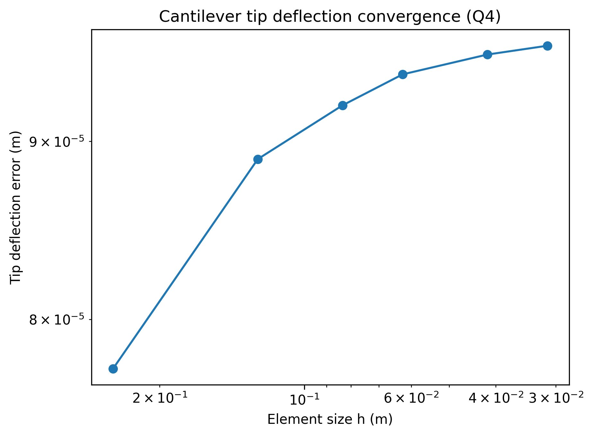
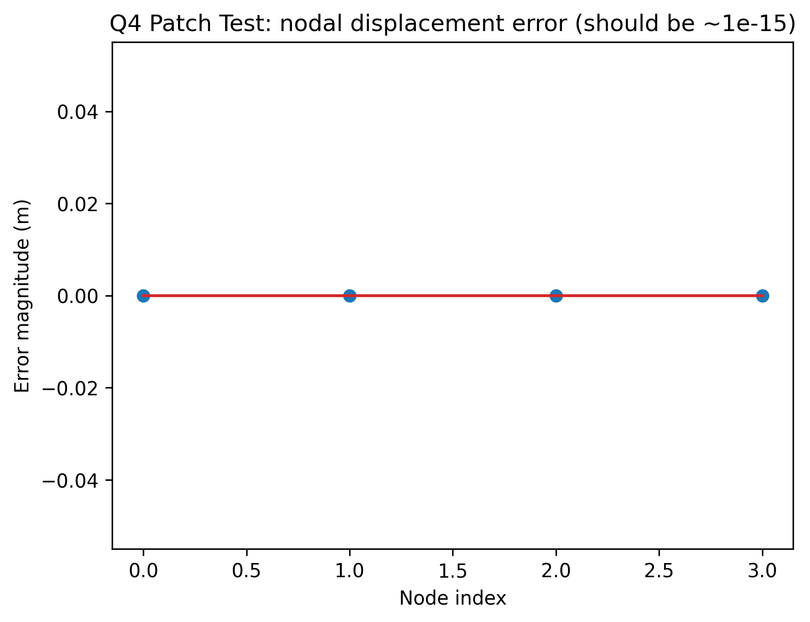
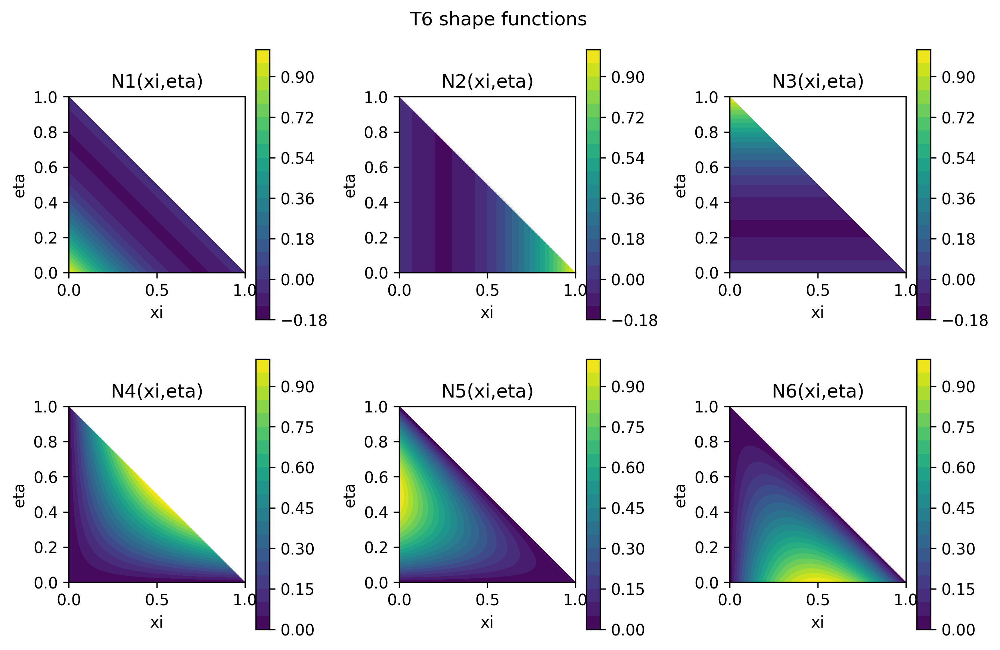

# Finite Element Portfolio 🧮⚙️

[](#)
[](#)
[](LICENSE)


[](https://github.com/blaketjohnson)

Lightweight **Finite Element Analysis (FEA) framework** built from scratch in Python.  
Covers both **heat conduction** and **structural mechanics** with examples, verification, and convergence studies.  
Designed as a professional portfolio piece to highlight FEM fundamentals, coding clarity, and numerical verification skills.

---

## ✨ Highlights for Recruiters
- Implements **T3, Q4, T6 elements** with isoparametric mapping & Jacobians.  
- Supports **plane stress/strain** and **heat conduction** constitutive laws.  
- Includes **Q4 patch test (exact)** and **convergence study** on a cantilever.  
- Clean modular code: shapes, Jacobians, materials, assembly, post-processing.  
- Demonstrates **Python/Numpy/SciPy/Matplotlib** workflow in engineering contexts.  

This repo shows core engineering skills in **numerical methods, verification & validation, technical documentation, and data visualization.**

---

## 📊 Example Results

### Heat Conduction
<p align="center">
  
  
</p>

### Structural Mechanics
<p align="center">
  
  
</p>

<p align="center">
  
  
</p>

### Verification
- **Q4 Patch Test:** passes with error ≈ 1e-15  
  <p align="center"></p>

### Shape Functions
<p align="center"></p>

---

## 🚀 Quick Start

```bash
git clone https://github.com/blaketjohnson/finite_elements_portfolio.git
cd finite_elements_portfolio

# install
pip install -r requirements.txt

# run examples
python examples/heat_q4_plate.py
python examples/heat_t3_plate.py
python examples/plane_stress_cantilever_q4.py
python examples/t6_shape_viz.py

# run verification tests
pytest tests/
```
Outputs (PNGs) will be saved into `docs/`.

---

## 🧠 Methods (Skimmable)
- Shape functions & derivatives: `∇N = J⁻¹ ∇̂N`  
- Stiffness assembly: `Ke = ∫ Bᵀ D B |J| dΩ` (structural), `Ke = ∫ (∇N)ᵀ k (∇N) |J| dΩ` (conduction)  
- Quadrature rules: Q4 (2×2), T3 (1-pt, 3-pt), T6 (custom visualization)  

---

## 📂 Repository Structure

```
finite_elements_portfolio/
├── src/fem/           # core FEM modules (shapes, jacobians, materials, assembly)
├── examples/          # runnable demo problems (heat, structural)
├── tests/             # verification (patch test, convergence)
├── docs/              # generated figures
└── README.md          # this file
```

---

## 📑 Background
Methods derived from **AME 5763 Finite Element Methods** (University of Oklahoma).  
Replicates homework + exam derivations as working Python code.

---

## 📌 About the Author
This project is part of a portfolio in **orbital mechanics, mission design, and aerospace systems engineering**.  
More projects available at: [GitHub Portfolio](https://github.com/blaketjohnson)


## 📜 License
MIT License — see [LICENSE](LICENSE).
